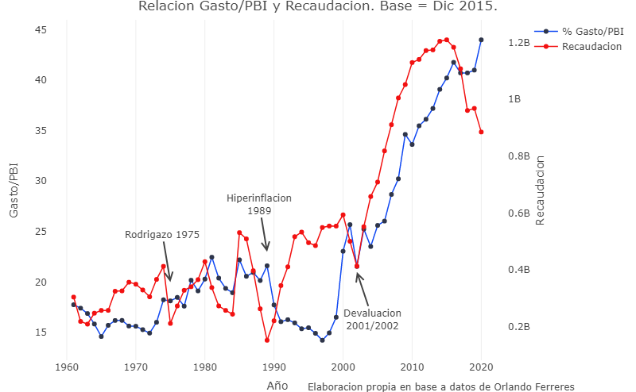
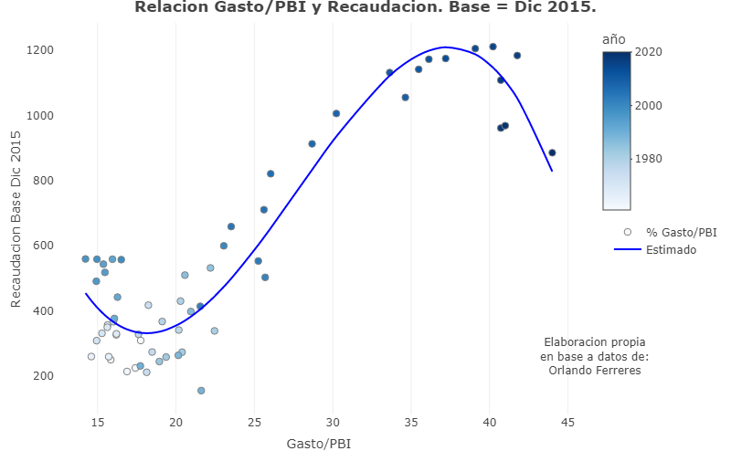
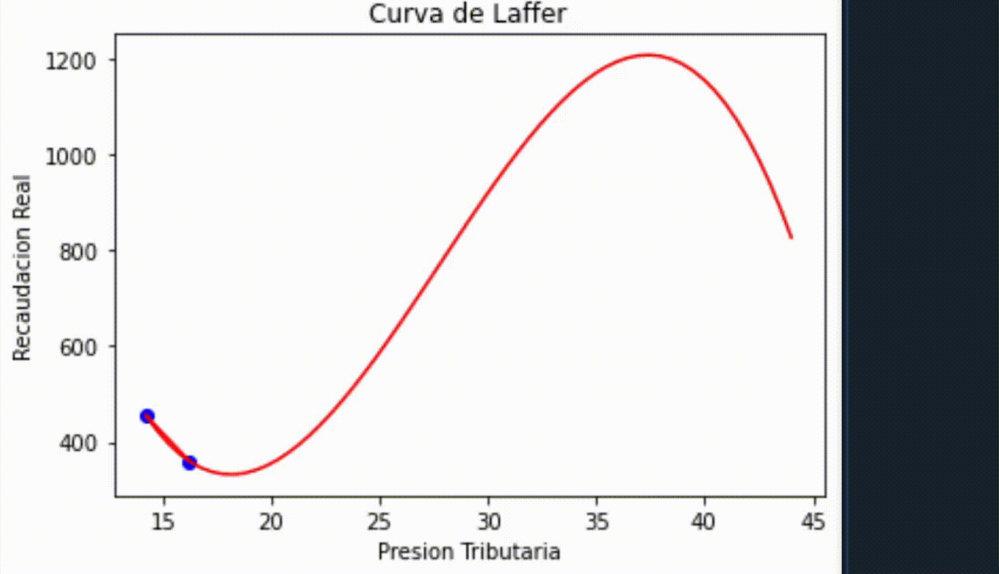

# CurvaDeLaffer
Presion Fiscal en Argentina desde 1961. Datos Macroeconomicos.

Una aproximacion a la curva de Laffer en Argentina.

Estimacion en Python de un polinomio que relaciona variables macroeconomicas de Argentina.

El dashboard se puede ver ------- > https://rpubs.com/MGaloto/Argentina_Laffer

## Relacion entre variables

## Polinomio Estimado

## Curva

